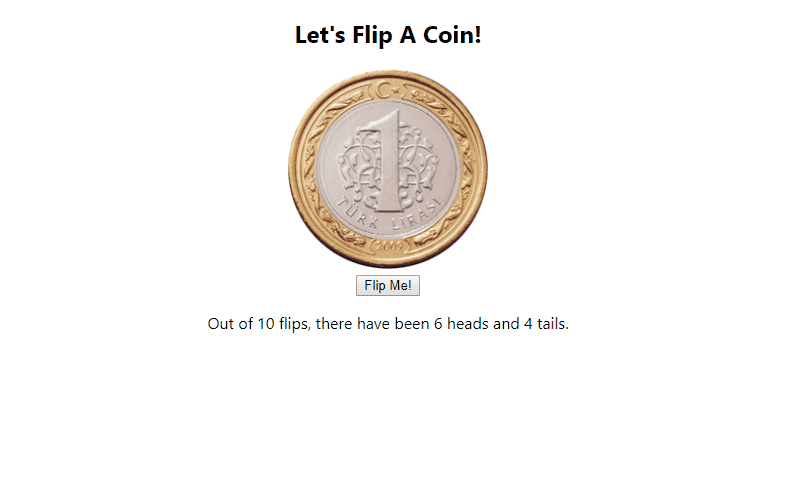

# Coin Flipper

This is coin flipper app. It calculates how many times coin is flipped and how many times it was landed tails and heads. Main purpose of building this app was to learn and practice React State. 

# Demo

Click the link below to see the app. 
[Netlify](https://tender-kare-5b5979.netlify.com/)

# Preview

# Author

Koray Dündar
